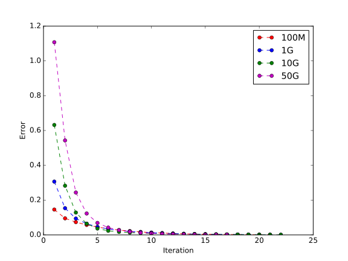

# Cloud Programming Homework 2

### 103062512 徐丞裕


## Instructions

### Build MapReduce Version

[Apache Maven](https://maven.apache.org/) is used as the build tool for MapReduce version of my program, you can install it locally in the project directory.

```sh
$ cd HW2_103062512_MR
$ script/bootstrap

Installing Apache Maven...
Apache Maven installed in tool/apache-maven
```

To fill up the jars, run `script/build`:

```sh
$ script/build

Building Hadoop MapReduce version...
....
[INFO] ------------------------------------------------------------------------
[INFO] BUILD SUCCESS
[INFO] ------------------------------------------------------------------------
[INFO] Total time: 4.131 s
[INFO] Finished at: 2016-05-15T10:41:30+08:00
[INFO] Final Memory: 122M/392M
[INFO] ------------------------------------------------------------------------
```

### Build Spark Version

To fill up the jar, use the following commands:

```sh
$ cd HW2_103062512_Spark
$ script/build

Building Spark version...
....
[success] Total time: 1 s, completed May 15, 2016 10:41:31 AM
```

### Run MapReduce Version

To execute the program, use the following command:

```sh
# run Hadoop MapReduce version
# usage: script/run inputFile outputDir
$ script/run /shared/HW2/sample-in/input-100M hw2/hadoop-100M
```

### Run Spark Version

To execute the program, use the following command:

```sh
# run Spark version
# usage: script/run inputFile outputDir
$ script/run /shared/HW2/sample-in/input-100M hw2/spark-100M
```

## Implementation

Both MapReduce version and Spark version share the same logic of data processing:

### Parsing the input text file into a graph 

First, break the file into lines, each line is a XML string representing a page.

Parse the line and extract `title` and `links` using regular expressions `<title>.+</title>` and `\[\[[^\]]\]\]` respectively.

Additional transformations to `title` and `links` are:

1. unescaping special characters in XML
2. trimming
3. reducing white spaces (consecutive white spaces will replaced with one single white space)
4. capitalizing 

#### Removing invalid links

I used some tricks to remove the invalid links:

Say we have three documents:

```
A -> [B, C]
B -> [C, D, F]
C -> [A, E]
```

We want to remove the links to non-existing documents `D`, `E`, and `F`.

We first build an inverted graph with a self-link for each existing documents:

```
A -> [*A, C]
B -> [*B, A]
C -> [*C, A, B]
D -> [B]
E -> [C]
F -> [B]
```

As you can see, for non-existing documents, no self-links will be built, thus we can use the rule to prune the invalid links.

#### Count number of documents

In MapReduce, `Counter` is used to record the number of documents.

In Spark, simple apply an action `.count` on RDD to get the number of documents.

### Perform iterations on the graph

#### Dangling Node Score

In each iteration, we need to calculate the sum of PageRanks of dangling nodes and pass it to each node.

In MapReduce, an job is launched to calculate the sum of the PageRanks and store in to a file so we can access the value later.

In Spark, simply do some `filter`-`map`-`sum` would do the trick.

#### Calculate New PageRank Score

In MapReduce, the input and output file will be in this format:

| Title | Previous PageRank | Current PageRank | Links |
|:---:|:---:|:---:|:---:|
| Spark | 0.03 | 0.05 | [ASF, Big Data, RDD]

So we can keep track of differences of score across consecutive iterations also preserving the links for next iteration.

For each iteration, document emits its scores to the documents it links to, and sum them up by document title to get the new PageRank score.

In Spark, this is relatively simple, just emit the score and reduce it by the document title, and we’re done.

#### Check if Convergence Criterion is Met

Using the structure mentioned in the previous section, we can easily calculate the differences of PageRank scores between current score and the one in the previous iteration.

Simply launch a job and write the result in a file for later access would do the trick for us.

In Spark, simply join the new score with the old one and sum them up.

If the convergence criterion is met, stop iterating and sort the results.

### Sort results

Sort by the PageRank scores, then the document titles.

## Execution Logs

### MapReduce

| Dataset | First Application ID | Last Application ID |
|:-------:|:--------------------:|:-------------------:|
| 100M | `application_1463345558261_4813` | `application_1463345558261_5129` |
| 1G | `application_1463345558261_5758` | `application_1463345558261_5911` |
| 10G | `application_1463345558261_6008` | `application_1463345558261_6076` |
| 50G | `application_1463345558261_6082` | `application_1463345558261_6159` |

### Spark

| Dataset | Application ID |
|:-------:|:--------------:|
| 100M | `application_1463345558261_2932` |
| 1G | `application_1463345558261_2936` |
| 10G | `application_1463345558261_2937` |
| 50G | `application_1463345558261_3067` |

## Experiment and Analysis

### Data Characteristics

| Dataset | #pages | #links | #invalid links | % of invalid links | 
|:-------:|:------:|:------:|:--------------:|:------------------:|
| 100M | 30,727 | 617,659 | 614,685 | 99.52% |
| 1G | 313,500 | 6,352,687 | 6,254,498 | 98.45% |
| 10G | 3,133,027 | 63,593,852 | 56,233,395 | 88.43% |
| 50G |  15,982,471 | 325,020,518 | 137,778,409 | 42.39% |

### PageRank Score


| Dataset | #1 | #2 | #3 | #4 | #5 | #6 | #7 | #8 |
|:-------:|:--:|:--:|:--:|:--:|:--:|:--:|:--:|:--:|
| 100M | 8.91E-4 | 4.22E-4 | 3.82E-4 | 3.79E-4 | 3.54E-4 | 3.51E-4 | 3.38E-4 | 3.23E-4 |
| 1G | 3.43E-3 | 2.08E-3 | 1.86E-3 |1.37E-3 | 1.36E-3 |1.21E-3 |1.13E-3 | 1.03E-3 |
| 10G | 4.91E-3 | 1.63E-3 | 1.19E-3 | 1.04E-3 | 1.02E-3 | 8.44E-4 | 7.73E-4 | 7.08E-4 |
| 50G | 9.69E-3 | 1.81E-3 | 1.50E-3 | 1.48E-3 |	 1.47E-3 | 1.41E-3 | 1.31E-3 | 1.10E-3 |

### Convergence Rate





### Performance Comparison

In this section, we will discuss the performance (in terms of time, since the PageRank scores should be the same) differences between MapReduce and Spark.


#### Parsing time


> since evaluation of Spark is lazy, we call `.collect` explicitly to activate the evaluation chain.

#### Iteration

The following figure shows the average execution time per iteration:


An iteration includes 3 kinds of operations:

1. calculate the aggregated score of dangling nodes
2. emit scores to neighbour nodes
3. update the score based on step 1 and 2

In MapReduce, step 1 is a separate job, while step 2 and 3 are in the same job and it’s associated with map and reduce phase respectively.

--

In MapReduce, the execution time is consistent across iterations since they are all disk I/O operations.

However, in Spark, the first iteration is much more slower than the following iterations since the first iteration would trigger an action `.sum` to enumerate the RDD. 

The following iterations will use a cached copy generated in the first iteration thus are faster.


## Experience and Conclusion

Processing data using Spark is like what we do in our local machine, but the program can be placed to a distributed system and it will work fine in the parallel environment.

However, writing programs for MapReduce is generally a process of searching for workarounds. 

Due to the time limitation, I could not make it to include more experiments that I planned to do.

For example, I would like to implement a faster version for Spark in [1] which utilize `partitionBy` to decrease the shuffle operations and yields better performance.

Also, comparing it with automatic partitioning mechanism provided by `GraphX` would also be interesting.

For the MapReduce part, I would like to try set the number of reducers dynamically so each file would be large enough to make MR perform well.

This can be done by analyzing the data characteristics.

\[1]: http://www-bcf.usc.edu/~minlanyu/teach/csci599-fall12/papers/nsdi_spark.pdf

## Feedback

TL;DR

This assignment is really interesting and we can have hands-on experience on processing large datasets that might not be suitable for traditional methods.

However, implementing two versions of the algorithm in a short period like this is quite challenging. It would be nice if we’re allowed to have few more days to finish the assignment.

Thank you so much for designing the assignment.